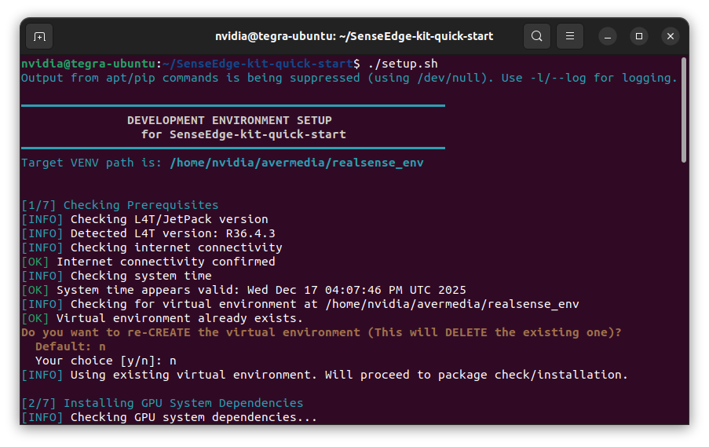
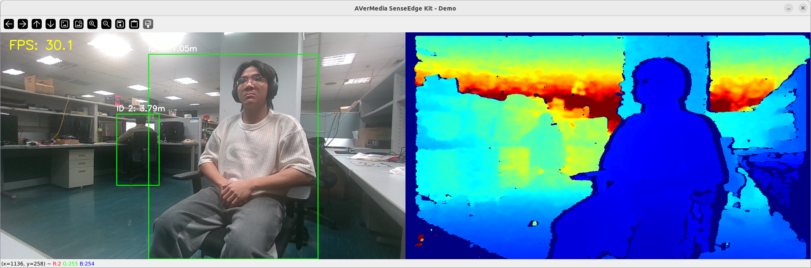

# SenseEdge Kit Quick Start

The AVerMedia **SenseEdge Kit** is an integrated development platform designed for real-time computer vision and depth-based AI applications. It combines the **AVerMedia D317 Carrier Board (populated with NVIDIA Jetson AGX Orin module)** with the **RealSense D457 depth camera**, allowing developers to quickly build spatial detection, perception, and distance-measurement workloads.

## What's in the Box

The SenseEdge Kit includes the following components:

- **AVerMedia D317 Carrier Board**  
  - Integrated NVIDIA Jetson AGX Orin module  

- **RealSense D457 Depth Camera**

- **GMSL-to-Jetson Interface Board**

- **GMSL/FAKRA Cable**

- **Power Adapter**

## Before You Start

The SenseEdge Kit comes with **JetPack 6.2 (L4T 36.4.3)** pre-installed. You may access the D317 by connecting a monitor, keyboard, and mouse to use the GUI directly, or by using any remote-access workflow you normally apply in Jetson development.

> [!NOTE]
> Unless explicitly noted, **all commands in this guide are intended to be executed on the Jetson device (D317)**.

## Run the Setup Script

SenseEdge Kit relies on a pre-tested JetPack environment on the Jetson device.  
Please clone the quick-start repository and run the setup script as follows:

```bash
git clone https://github.com/AVerMedia-Technologies-Inc/SenseEdge-kit-quick-start.git
cd SenseEdge-kit-quick-start
```

The `setup.sh` script will automatically perform the following steps:

- Check the system environment (e.g., JetPack version, network connectivity, system time).  
- Install the CUDA compiler and TensorRT dependencies.  
- Install `pip` and the Python `venv` module if missing.  
- Create a dedicated virtual environment named `realsense_env` under the `~/avermedia/` directory.  
- Activate the environment and install required Python libraries (e.g., `pycuda`, `opencv-python`, `pyrealsense2`).  
- Prompt the user to confirm whether to download the necessary AI models (default: Yes).

```bash
./setup.sh
```


> Figure: The setup script will prompt you to make some choices, such as whether to synchronize the system time or download the required AI models. Please follow the instructions to complete the setup.

### Model Download

If you **did not choose** to download the models during the `setup.sh` script execution, you can run the following command later to download them separately:

```bash
./scripts/download_model.sh
```

## Run the Demo

To verify that the RealSense D457 and the AI stack are working properly, we provide a simple Python example. This example covers color and depth streaming, AI inference using a YOLO model, and distance estimation based on depth data.

Follow these steps to activate the virtual environment and run the demo:

1.  **Activate the Virtual Environment:**

    ```bash
    source ~/avermedia/realsense_env/bin/activate
    ```

2.  **Run the Python Demo:**

    ```bash
    python demo.py
    ```

After execution, the application window will display synchronized color and depth streams with overlayed AI inference results.



> Figure: Real-time detection showing bounding boxes and depth heatmaps; the boxes turn red to trigger a proximity warning when the calculated 3D distance between individuals is too close.

## Customize Your Development

The SenseEdge Kit provides a complete, ready-to-use environment for any depth-camera-based AI or **computer vision application**. The development environment supports core frameworks and libraries like PyTorch, TensorRT, ONNX Runtime, RealSense SDK, and OpenCV.

Once you have access to synchronized color and depth frames, you are free to integrate your own algorithms, models, or processing pipelines, such as:

* Object or person detection
* Pose estimation and segmentation
* 3D scene understanding and depth measurement
* Gesture recognition or human-computer interaction sensing

